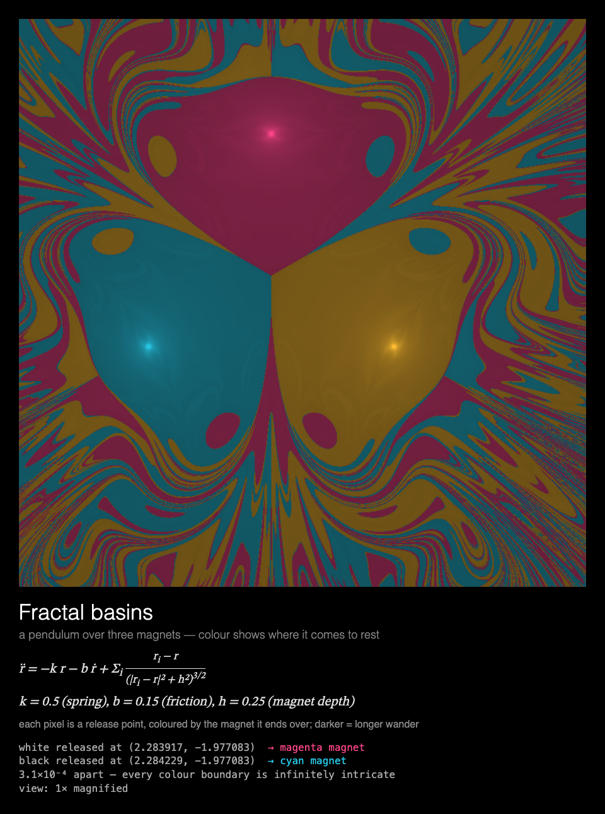

# MMM-FractalBasins

A [MagicMirror²](https://magicmirror.builders/) module that swings a pendulum over three magnets and zooms ×1000 into the fractal map of where it comes to rest, drawn for a Raspberry Pi without a GPU.



## What you see

**Fractal basins.** A pendulum over three magnets: each pixel is coloured by the magnet it ends
over, darker the longer it wandered first. Two bobs released 3×10⁻⁴ apart, one white and one
black, swing live over the map and land on different magnets; then the view zooms ×10, ×100,
×1000 into the boundary where they started, holding each close-up for a few seconds. The last
one then holds until the module is shown again.

Under the map: the pendulum's equation of motion and its constants, and a readout of where each
bob was released, which magnet it ended over, how far apart they started, and the current
magnification.

The sequence takes a little under a minute, so give the module a page of about a minute to show
all of it. A new sequence starts each time the module is shown again.

Built for a **Raspberry Pi 3 without GPU acceleration**: everything is drawn by the CPU, the
maps are rendered ahead of time, the module rests while a picture is held, and the animation
stops while the module is hidden (see [Performance](#performance)).

## Installation

```bash
cd ~/MagicMirror/modules
git clone https://github.com/charleswest775/MMM-FractalBasins
```

No npm dependencies: there is nothing to install.

## Update

```bash
cd ~/MagicMirror/modules/MMM-FractalBasins
git pull
```

## Configuration

```js
{
	module: "MMM-FractalBasins",
	position: "middle_center",
	config: {
		cycleSeconds: 600,  // longer than the page is shown: one sequence per showing
		width: 900,
		height: 900,
		fps: 20
	}
},
```

| Option | Default | Description |
|---|---|---|
| `cycleSeconds` | `60` | Start the sequence again this often; it also starts again each time the module is shown |
| `width`, `height` | `900` | Canvas size in pixels |
| `fps` | `20` | Frame-rate cap |
| `showMath` | `true` | Equations and live numbers under the canvas |
| `turns` | `null` | Take turns with other modules on the same page, e.g. `{ of: 2, at: 1 }` (see [Taking turns](#taking-turns)) |
| `statsPanel` | `false` | A line under the math showing what the mirror spends: fps, CPU of Electron and the compositor, a bar per core, temperature, and the time to the next start. Sampled by the module's `node_helper` from `/proc`, only while the module is shown |
| `debugStats` | `false` | Show achieved fps and per-frame timings in the corner of the screen |

## Taking turns

With `turns: { of: n, at: k }`, modules on the same [MMM-pages](https://github.com/edward-shen/MMM-pages)
page each show on their own one in n showings of it: `at: 0` on the first showing and every
nth after it, `at: 1` on the second, and so on. A module that isn't on its turn takes no room on
the page and costs nothing: it hides its canvas and doesn't start. So one slot in the rotation
can hold several pages, without making the rotation longer. For example, two kinds of fractal,
the magnetic pendulum's basins and [MMM-FractalZoom](https://github.com/charleswest775/MMM-FractalZoom)'s
dives into the Mandelbrot set, one per showing:

```js
{
	module: "MMM-FractalBasins",
	classes: "page-fractal",
	position: "middle_center",
	config: { turns: { of: 2, at: 0 } }
},
{
	module: "MMM-FractalZoom",
	classes: "page-fractal",
	position: "middle_center",
	config: { turns: { of: 2, at: 1 } }
},
{
	module: "MMM-pages",
	config: { modules: [["page-clock"], ["page-fractal"]], rotationTime: 60000 }
},
```

Without `turns` the module shows every time. It works just as well on a page of its own, or in
a normal region without MMM-pages, where it starts the sequence again every `cycleSeconds`.

## What's real

The pendulum is a bob on a spring-like restoring force, swinging in a plane over three magnets
set a height h below it on a circle, 120° apart, with friction (`simulations/magnetic-pendulum.js`,
a small-angle model):

r̈ = −k r − b ṙ + Σᵢ (rᵢ − r) / (|rᵢ − r|² + h²)^{3/2},  with k = 0.5, b = 0.15, h = 0.25.

Friction makes it always come to rest over one of the magnets, but which one depends on where
it was released so sensitively that the map of outcomes, the basins of attraction, is a fractal.
It is integrated by the classical fourth-order Runge–Kutta method with a fixed step of 0.02, for
up to 80 time units; a bob counts as captured once it has been slow and close to one magnet for
25 steps in a row. The live bobs run at four simulated time units per second.

Each map is 1000×1000 release points, each released at rest and integrated until captured: a
pixel is coloured by its magnet and shaded by how long it took, bright for a quick capture, dark
for a long chaotic wander. The views are ×1, ×10, ×100 and ×1000; each zoom goes to the window
of the last view with the most basin boundaries and all three colours in it. In every view the
renderer finds two release points an eighth of the view apart that end on different magnets;
the pair that swings live is the one from the deepest view.

The maps are rendered ahead of time by `node tools/render-basins.js` (all cores, ~2 min on a
Mac): at ~3.5 ms per pixel, a Pi 3 would need ~47 minutes of CPU for one 900×900 map.

The tests check that friction only ever removes energy, that a bob released right above a
magnet stays with it, that the basins share the magnets' three-fold symmetry, that the map
converges (halving the time step changes almost no outcomes), and that the shipped maps were
rendered with the same parameters and their release pairs really end on different magnets.

## Performance

Measured on a Raspberry Pi 3 B+ (Electron 42, software rendering), 900×900 at 20 fps over 60 s,
as CPU of the Electron processes plus the `cage` compositor, in % of one core (the Pi has
four); baseline mirror without the module: 0.2%.

| | % of one core | achieved fps |
|---|---|---|
| module **hidden** (e.g. another MMM-pages page) | 0.3 | 0 |
| while a picture is held | ~7 | |
| average over the sequence | 42 | 20 |

The map fades in, then only the bobs' new path segments are drawn each frame, over the map
already on the canvas. Each zoom redraws the whole canvas for 2 s; each close-up is drawn once
and held, and the module rests.

Why it costs what it does, from micro-benchmarks on the Pi:

- There is no GPU acceleration to be had (the Pi 3's GPU only does GLES 2.0; Chromium needs
  3.0), so every pixel is drawn by the CPU.
- Any frame that changes the canvas costs ~2% of a core per fps, before drawing anything.
- On top of that, cost grows with the **area that changes**: Chromium redraws the bounding box
  of everything touched in a frame. So the swing draws only what's new, and whole-canvas
  redraws are kept to the fade-in and the zooms.
- JavaScript is not the bottleneck: the maps are precomputed, so the Pi only integrates two bobs.
- The frame loop sleeps with `setTimeout` until a frame is due. While a picture is held the
  module rests, and is only polled twice a second. While MagicMirror² fades the module out,
  nothing new is drawn; once it is hidden, the loop stops.

## Development

```bash
node --test                  # physics checks (no dependencies)
python3 -m http.server       # then open http://localhost:8000/dev/preview.html
node tools/render-basins.js  # re-render assets/basins-*.png and basins.json after changing the pendulum
```

`dev/preview.html` runs the module outside MagicMirror², in a portrait 1200×1920 frame, with
hide/show buttons that follow MagicMirror²'s suspend/resume order. Query options override the
config, e.g. `?width=700&height=700&fps=12`, or `?cycleSeconds=60` to start again every minute.

## License

MIT

Part of a family of MagicMirror² modules:
[MMM-ChaosTheory](https://github.com/charleswest775/MMM-ChaosTheory) (all eight chaos simulations in one module),
[MMM-LorenzAttractor](https://github.com/charleswest775/MMM-LorenzAttractor),
[MMM-DoublePendulum](https://github.com/charleswest775/MMM-DoublePendulum),
[MMM-LogisticMap](https://github.com/charleswest775/MMM-LogisticMap),
[MMM-SymmetricIcons](https://github.com/charleswest775/MMM-SymmetricIcons),
[MMM-ThreeBody](https://github.com/charleswest775/MMM-ThreeBody),
[MMM-ChaoticBilliards](https://github.com/charleswest775/MMM-ChaoticBilliards) and
[MMM-Rule30](https://github.com/charleswest775/MMM-Rule30);
and beyond chaos, [MMM-Atom](https://github.com/charleswest775/MMM-Atom),
[MMM-FractalZoom](https://github.com/charleswest775/MMM-FractalZoom),
[MMM-Chladni](https://github.com/charleswest775/MMM-Chladni),
[MMM-SacredGeometry](https://github.com/charleswest775/MMM-SacredGeometry),
[MMM-Tilings](https://github.com/charleswest775/MMM-Tilings),
[MMM-PlanetsDance](https://github.com/charleswest775/MMM-PlanetsDance),
[MMM-SnowCrystal](https://github.com/charleswest775/MMM-SnowCrystal) and
[MMM-NightSky](https://github.com/charleswest775/MMM-NightSky).
